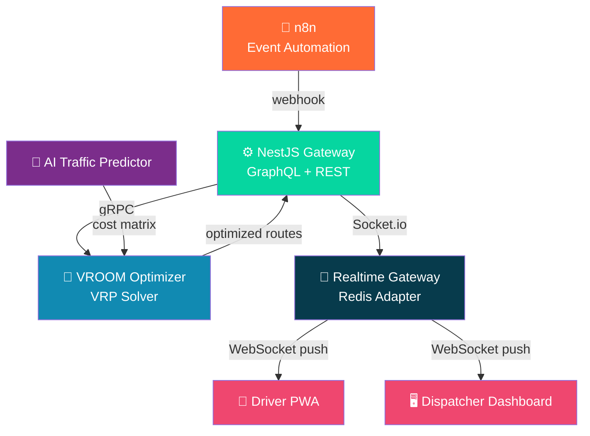

# 🚦 LogiFlow

[](https://github.com/Logiflow-Gavilanes-ECI/logiflow/actions/workflows/ci.yml)
[](https://sonarcloud.io/summary/new_code?id=Logiflow-Gavilanes-ECI_logiflow)
[](LICENSE)
[](https://nodejs.org/)
[](https://www.docker.com/)

```
  ██╗      ██████╗  ██████╗ ██╗███████╗██╗      ██████╗ ██╗    ██╗
  ██║     ██╔═══██╗██╔════╝ ██║██╔════╝██║     ██╔═══██╗██║    ██║
  ██║     ██║   ██║██║  ███╗██║█████╗  ██║     ██║   ██║██║ █╗ ██║
  ██║     ██║   ██║██║   ██║██║██╔══╝  ██║     ██║   ██║██║███╗██║
  ███████╗╚██████╔╝╚██████╔╝██║██║     ███████╗╚██████╔╝╚███╔███╔╝
  ╚══════╝ ╚═════╝  ╚═════╝ ╚═╝╚═╝     ╚══════╝ ╚═════╝  ╚══╝╚══╝
```

> **AI-powered real-time fleet routing — solving the Vehicle Routing Problem, one traffic jam at a time.**

---

## 🗺️ What is LogiFlow?

LogiFlow is a scalable, real-time fleet routing platform built for the Colombian logistics landscape. It continuously solves the **Vehicle Routing Problem (VRP)** across multiple vehicles and delivery points — optimizing routes on the fly whenever traffic, weather, or a new urgent order changes the picture.

Every reroute is calculated in **under 4 seconds** and pushed instantly to drivers via WebSockets. No polling. No stale routes. No missed windows.

---

## 🏗️ System Architecture



**End-to-end flow:** Traffic jam detected → n8n fires event → NestJS receives webhook → gRPC call to VROOM → AI-adjusted optimal routes returned → Socket.io pushes new route to every affected driver in real time.

---

## 📦 Monorepo Structure

This is a monorepo. Each service is fully independent — its own `package.json`, `Dockerfile`, and local `docker-compose`. The root only provides shared contracts and the integration compose file.

```
logiflow/
├── services/
│   ├── optimizer/          ← gRPC server + VROOM VRP engine        @cris-eci
│   ├── gateway/            ← NestJS core, GraphQL, gRPC client      @Juanseom
│   ├── realtime/           ← Socket.io gateway + Redis adapter      @Eliza-05
│   └── automation/         ← n8n workflows + CI pipeline            @AnderssonProgramming
├── shared/
│   └── proto/
│       └── route-optimizer.proto ← Single source of truth for gRPC contract
├── docker-compose.yml      ← Full system integration (all services)
├── docker-compose.dev.yml  ← Local dev overrides
└── .gitignore
```

> **Rule:** The `shared/proto/route-optimizer.proto` file is owned by `@cris-eci` and is the canonical contract between `optimizer` and `gateway`. Never duplicate it.

---

## 🚀 Quick Start

### Prerequisites

- [Docker + Docker Compose](https://docs.docker.com/compose/)
- [Node.js 20+](https://nodejs.org/)

### Run the full system

```bash
git clone https://github.com/Logiflow-Gavilanes-ECI/logiflow.git
cd logiflow
docker compose up
```

That's it. All four services start, wire up, and the system is live.

| Service | URL |
|---|---|
| NestJS Gateway (GraphQL) | http://localhost:4000/graphql |
| Socket.io Realtime Gateway | http://localhost:3001 |
| n8n Automation | http://localhost:5678 |
| VROOM Optimizer (internal) | gRPC on port 50051 |

### Run a single service

Each service can run independently for development:

```bash
cd services/optimizer
docker compose up
```

See each service's own `README.md` for its specific setup, environment variables, and test instructions.

---

## 🔌 gRPC Contract

All inter-service communication between `gateway` and `optimizer` uses the shared proto definition:

```protobuf
// shared/proto/route-optimizer.proto
service RouteOptimizer {
  rpc SolveRoute (SolveRouteRequest) returns (SolveRouteResponse);
}
```

If you need to change the contract, open a PR and tag both `@cris-eci` and `@Juanseom`. Never change field numbers on existing messages — add new fields only.

---

## 🌿 Git Workflow

```
main          ← stable, demo-ready. Protected.
└── develop   ← sprint integration target. Protected.
    ├── feat/cristian/optimizer-grpc
    ├── feat/sebastian/nestjs-core
    ├── feat/elizabeth/socket-gateway
    └── feat/andersson/n8n-ci
```

**Commit convention** — [Conventional Commits](https://www.conventionalcommits.org/):

```bash
feat(optimizer): add gRPC server with VROOM proxy
fix(gateway): correct proto import path
chore: add root docker-compose integration file
docs(realtime): add Socket.io room conventions to README
```

**PR merge order** (important for tonight's integration):
1. `optimizer` — proto contract must land first
2. `realtime` — no upstream dependency
3. `automation` — self-contained
4. `gateway` — depends on proto + realtime event names

---

## 🧪 Testing

Each service runs its own test suite. From any service folder:

```bash
npm test          # run all tests with coverage
npm run test:watch  # watch mode during development
npm run lint        # ESLint
```

CI runs on every push to `main`, `develop`, and `feat/**` branches:

```
push → checkout → Node 20 → npm ci → ESLint → Jest + coverage → SonarCloud
```

---

## 👥 Team

| Name | Handle | Service Ownership |
|---|---|---|
| **Andersson David Sánchez Méndez** | @AnderssonProgramming | `automation` — n8n + CI |
| **Cristian Santiago Pedraza Rodríguez** | @cris-eci | `optimizer` — gRPC + VROOM |
| **Elizabeth Correa Suárez** | @Eliza-05 | `realtime` — Socket.io + Redis |
| **Juan Sebastian Ortega Muñoz** | @Juanseom | `gateway` — NestJS + GraphQL |

---

## 📄 License

MIT © 2026 LogiFlow — Escuela Colombiana de Ingeniería Julio Garavito
